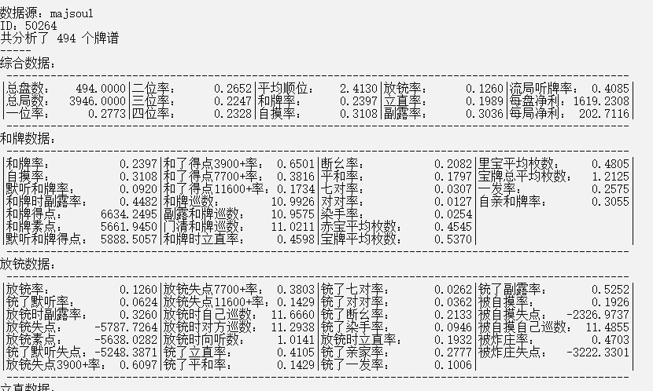

# MajsoulPaipuAnalyzer

> [!CAUTION]
> 2024.10.13 有报告使用后可能导致账号封禁，请谨慎使用。需要转换天凤牌谱建议使用其他方法（如[mjai-reviewer's instruction](https://github.com/Equim-chan/mjai-reviewer/blob/master/mjsoul.adoc)），基础数据分析可以使用[牌谱屋](https://amae-koromo.sapk.ch/)。使用该工具导致的任何结果作者均不会承担任何责任。

自制雀魂牌谱分析工具。支持国服、日服、国际服。提供Windows，Linux，macOS版本。
**受设备所限，目前Linux版本和macOS版本无法测试，仅由Actions自动构建不保证可用性。**

目前仅支持四人麻将牌谱分析，分析项目参考天鳳の牌譜解析プログラム的项目实现。目前实现了除被鸣牌和门清听牌大类外，剩余大类中的大部分数据。

在结果展示网页中带有分析天凤凤凰桌牌谱得到的数据，可以用于和自己的数据进行比较。

[更新内容说明文件](doc/release-notes.txt)

## 免责声明
该工具为个人制作，未对雀魂代码逻辑进行改动，但是为了获取牌谱数据使用了极少量前端代码的API，包括**获取用户牌谱列表**和**获取指定牌谱内容**。所有相关操作代码均在[browseinject.js](lib/majsoul/browseinject.js)中，工具不会代替用户执行任何其他交互性操作。请自行判断使用该工具的风险。如果使用该工具或（不存在的）该工具的衍生物产生的一切后果作者均不会承担任何责任。

## 下载

<!-- APPVeyor下载最新版本： -->

<!-- Windows:  Linux:  -->

使用Github Actions持续集成，在网盘和releases提供下载。

[releases](https://github.com/zyr17/MajsoulPaipuAnalyzer/releases)中可下载已经编译好的文件。

[百度网盘](https://pan.baidu.com/s/1mu31kzaF7aHkY2IeBjCLyg) 提取码：k34a

## 界面

工具分为两部分，MajsoulPaipuCrawler和PaipuAnalyzer。

MajsoulPaipuCrawler使用Electron编写，用于从雀魂收集牌谱并转换成自用牌谱格式。

PaipuAnalyzer使用C++编写，分析收集到的牌谱数据并在命令行窗口中展示数据。

同时PaipuAnalyzer会生成用于查看和比较数据的网页PaipuAnalyzeResult.html。

## 安装

### 编译/测试环境

Windows: Windows 10, nodejs v10.13.0, MinGW-w64 8.1.0

Linux: Ubuntu 18.04 x64, nodejs v8.1.0, g++ 7.4.0

macOS: 10.14 (VMware Workstation 15), nodejs v12.4.0, g++ 4.2.1(映射到clang-1001.0.46.4)

AppVeyor环境请参考[其网站](https://www.appveyor.com/docs/build-environment/)

Github Actions环境请参考workflow配置

### 依赖

需要npm, g++, cmake, make/mingw32-make

### 安装脚本

三平台安装脚本参考[这里](doc/install_scripts.md)。

## 使用

[这里](doc/README.txt)提供了简易使用说明。

### 牌谱获取及转换

首先运行Electron应用MajsoulPaipuCrawler。程序会显示雀魂窗口和SimpleMahjong窗口。由于技术原因，第三方账户登陆可能出现问题，请使用网页-登陆专用窗口登陆后刷新雀魂窗口。默认为国服，如果要切换到其他服请在网页菜单中选择。

在成功登陆后，可以选择**牌谱-查看已有牌谱**情报。如果加载未完成会弹出错误对话框，否则会开始自动收集账户的牌谱基本信息，并展示收集到的牌谱类型。

在确认所有牌谱已井在牌谱情报中展示后，点击**牌谱-下载&转换牌谱**来对获取到的牌谱进行下载和格式转换。转换会跳过三麻和比赛牌谱。转换进度显示在SimpleMahjong窗口的左上角。

雀魂包含十分繁杂的对局规则，规则间差异很大。由于将不同规则牌谱同时分析意义不大（例如包含了宝牌狂热的牌谱，和牌番数、宝牌数量以及攻守判断都会和段位规则牌谱差很多），同时部分规则和四麻段位规则并不兼容（三麻，换三张，古役，血战等），可能引起工具出现不可预料的问题，因此相关牌谱只会下载，而不会分析，列于未识别牌谱中。实际下载的牌谱数量会多于分析的牌谱数量。

每个账户会有自己的独立ID，这个ID和加好友时候的那个ID是不一样的，游戏里大概不能直接看到？如果登陆多个账户，会将每个账户的资料按照ID分别存储，不会混在一起。牌谱下载及转换内容存储于data文件夹，避免重复下载和转换，每次进行下载仅会尝试下载转换未下载的牌谱。存储方式不再赘述，感兴趣的人翻一翻大概就能明白了。

点击**转换天凤牌谱**选项可以将该账户的所有能转换的牌谱尝试转换成天凤牌谱格式，相关转换代码来自[Equim-chan](https://github.com/Equim-chan)的[akochan-reviewer](https://github.com/Equim-chan/akochan-reviewer)。成功转换的牌谱存储在`data/majsoul/%ID%/tenhou`中。目前较早牌谱的转换结果可能不可靠，仅供参考。

### 牌谱分析

完成牌谱收集后即可关闭Electron应用。然后使用PaipuAnalyzer进行牌谱分析。

在进行分析前，请确认data/config.json文件。在该文件中存储了牌谱分析的各种配置。关于配置文件各项内容的含义请参照[这里](doc/config.md)。

确认配置无误后，运行PaipuAnalyzer即可得到结果。部分统计规则和雀魂官方有所出入(我不知道官方是怎么算的，反正结果和官方差了一点)。一些项目的计算方式和特殊说明请参照[这里](doc/result.md)。

### 公共牌谱池

在0.5.0版本新增公共牌谱池，相关选项在 公共牌谱列表 中。和账户牌谱获取相比，主要在收集牌谱列表上有不同，可以手动输入或是选择文件输入。收集牌谱列表后同样需要下载转换，公共牌谱池和所有账户分离存储，如果需要将某账户的牌谱导入公共牌谱池，可：
1. 公共牌谱列表-下载指定牌谱-文件输入-选择`data/majsoul/%ID%/gamedata.txt`
2. 如果牌谱数量很多，将`data/majsoul/%ID%/raw|paipus`中文件复制到`data/majsoul/0/raw|paipus`中，避免重复下载
3. 公共牌谱列表-下载转换牌谱，等待下载转换完成

目前公共牌谱池支持指定玩家id为主视角，分析该玩家牌谱数据的功能。分析公共牌谱池中的牌谱步骤如下：
1. 查询到玩家id。打开包含该玩家的牌谱，如`data/majsoul/0/paipus/190205-4f533de1-ba3e-4876-b6ea-8cf1f18a5559`，搜索玩家名称，可以在名称前看到玩家id。如`Zyr17`的id为`50264`
2. 在PaipuAnalyzer的config中，id前加0作为id。接上例，id填写`050264`
3. 其他配置和分析个人牌谱相同

## 已知问题

由于雀魂官方的牌谱查看只支持1000个牌谱，而MajsoulPaipuCrawler基于官方操作，如果超过了1000个牌谱目前没有办法获取。如果有好办法请至[issue](https://github.com/zyr17/MajsoulPaipuAnalyzer/issues/5)中指导作者。

Ubuntu高版本中可能会出现GUI将可执行文件当做动态链接库的情况。目前没有找到解决方法，请使用Terminal执行。

如果运行Electron时出现游戏界面黑屏、白屏、崩溃等问题，有可能是显卡对WebGL的支持问题，可以尝试将resources/app/main.js文件第24行附近的app.isableHardwareAcceleration双斜杠删去，关闭硬件加速运行。

对比赛场支持不完善，目前仅可对和段位场配置基本相同的比赛场进行分析，具体可参照`main.js:isspecialrule`。

0.4.9版部分数据准确性存疑，正在尝试找到问题。

天凤牌谱转换对较早的牌谱不能成功转换。

## 联系

如果发现任何bug，可以通过[github](https://github.com/zyr17/MajsoulPaipuAnalyzer/issues)或是jzjqz17@gmail.com说明。

## 致谢

该项目使用或曾经使用了这些项目的资源，感谢他们。

[CJsonObject](https://github.com/Bwar/CJsonObject)

[mt19937ar-MersenneTwister-JS](https://github.com/neetsdkasu/mt19937ar-MersenneTwister-JS)

[js-sha512](https://github.com/emn178/js-sha512)

[牌面图像](https://mj-king.net/sozai/)

[wsHook](https://github.com/skepticfx/wshook)

[wssip](https://github.com/nccgroup/wssip)

[akochan-reviewer](https://github.com/Equim-chan/akochan-reviewer)
